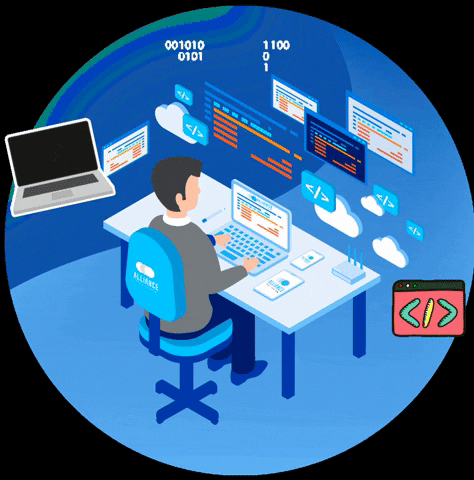

<h1 align="center">Hi 👋, I'm Azfar Mahmoodi</h1>
  </h1>
  <!-- -->
  <!-- -->
    
    <!--   -->
<h2 align="center"> ✨ About Me</h2>

  
📝 I’m a pre-final year student at **VIT'c**

🔭 I’m currently working on **Backend Development**

🌱 I’m currently learning **Data Structures**

📫 You can reach me at **azfarmahmoodi666@gmail.com**

  

  

<h2 align="left" color=FFF>🌐 Connect with me:</h2>

  

<h2 align="center" color=FFF>💻Languages & Tools </h2>

                 <a href="https://opencv.org/" target="_blank" rel="noreferrer">   </a>        

  <a href="https://skillicons.dev">
    
<!--      -->
  </a>
   

<h2 align="center" color=FFF>📈 Stats </h2>

&nbsp;

&nbsp;

<!---  --->

<!---  ---> 
<!--- ---> 
<!------> 

<!---  ---> 

<!---   

<!---  --->

<!---  pink --->

<!--- green--->

 
<h2> </h2>

 

